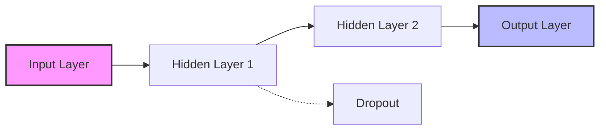

## 1. 数学公式 (LaTeX)

我们来看一下 Transformer 的注意力机制公式：

$$
\text{Attention}(Q, K, V) = \text{softmax}\left(\frac{QK^T}{\sqrt{d_k}}\right)V
$$

行内公式测试：$e^{i\pi} + 1 = 0$。

## 2. 流程图 (Mermaid)

这是一个神经网络的简单示意图：

